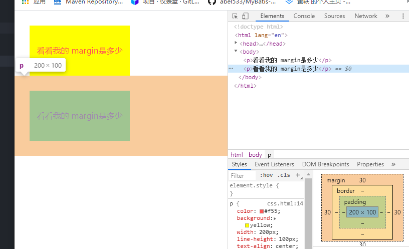
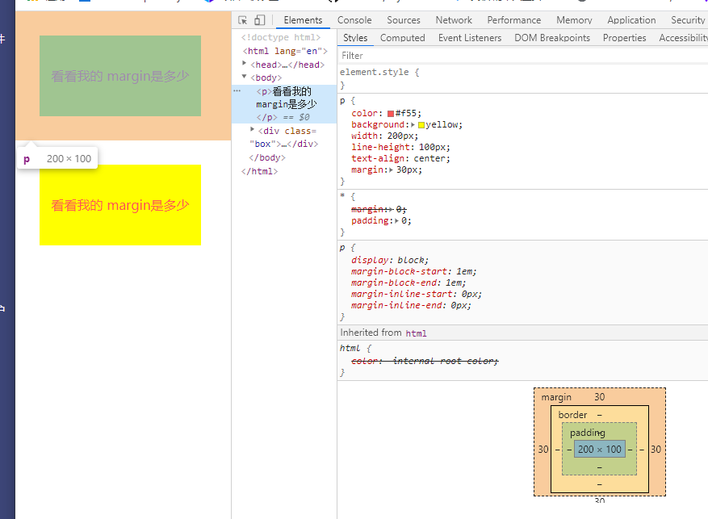
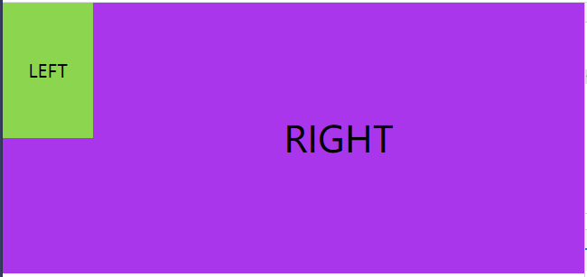
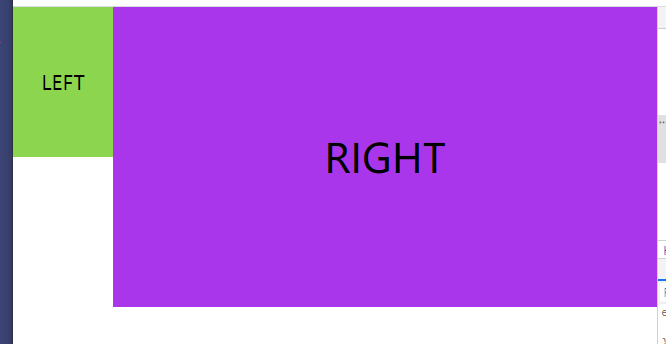

# BFC

BFC(Block formatting context)直译为“块级格式化上下文”，它是一个独立的渲染区域，只有 Block-level box 参与，它规定了内部的 Block-level Box 如何布局，并且与这个区域外部毫不相干。

在了解什么是 BFC 之前，我们现需要知道 Box,Formatting Context 的概念。

## Box: css 布局的基本单位

Box 是 CSS 布局的对象和基本单位， 直观点来说，就是一个页面是由很多个 Box 组成的。元素的类型和 display 属性，决定了这个 Box 的类型。 不同类型的 Box， 会参与不同的 Formatting Context（一个决定如何渲染文档的容器），因此 Box 内的元素会以不同的方式渲染。让我们看看有哪些盒子：

- `block-level box:display 属性为 block, list-item, table 的元素，会生成 block-level box。并且参与 block fomatting context；`
- `inline-level box:display 属性为 inline, inline-block, inline-table 的元素，会生成 inline-level box。并且参与 inline formatting context；`

## Formatting Context

Formatting context 是 W3C CSS2.1 规范中的一个概念。它是页面中的一块渲染区域，并且有一套渲染规则，它决定了其子元素将如何定位，以及和其他元素的关系和相互作用。最常见的 Formatting context 有 Block fomatting context (简称 BFC)和 Inline formatting context (简称 IFC)。

> BFC 是一个独立的布局环境，其中的元素布局是不受外界的影响，并且在一个 BFC 中，块盒与行盒（行盒由一行中所有的内联元素所组成）都会垂直的沿着其父元素的边框排列。

## BFC 的布局规则

- `内部的 Box 会在垂直方向，一个接一个地放置。`
- `每个盒子（块盒与行盒）的 margin box 的左边，与包含块 border box 的左边相接触(对于从左往右的格式化，否则相反)。即使存在浮动也是如此。`
- `BFC 的区域不会与 float box 重叠。`
- `BFC 就是页面上的一个隔离的独立容器，容器里面的子元素不会影响到外面的元素。反之也如此。`
- `计算 BFC 的高度时，浮动元素也参与计算。`

## 如何创建 BFC

- `float 的值不是 none。`
- `position 的值不是 static 或者 relative。`
- `display 的值是 inline-block、table-cell、flex、table-caption 或者 inline-flex`
- `overflow 的值不是 visible`

## BFC 的作用

- **1.利用 BFC 避免 margin 重叠。**

以下是实例代码：

```html
<!DOCTYPE html>
<html lang="en">
  <head>
    <meta charset="UTF-8" />
    <meta name="viewport" content="width=device-width, initial-scale=1.0" />
    <meta http-equiv="X-UA-Compatible" content="ie=edge" />
    <title>防止margin重叠</title>
  </head>
  <style>
    * {
      margin: 0;
      padding: 0;
    }
    p {
      color: #f55;
      background: yellow;
      width: 200px;
      line-height: 100px;
      text-align: center;
      margin: 30px;
    }
  </style>
  <body>
    <p>看看我的 margin是多少</p>
    <p>看看我的 margin是多少</p>
  </body>
</html>
```

生产的页面效果是这样的：


根据第二条，属于同一个 BFC 的两个相邻的 Box 会发生 margin 重合，所以需要设置两个不同的 BFC,也就是将第二个用 div 包裹，然后使其变成一个 BFC

```html
<!DOCTYPE html>
<html lang="en">
  <head>
    <meta charset="UTF-8" />
    <meta name="viewport" content="width=device-width, initial-scale=1.0" />
    <meta http-equiv="X-UA-Compatible" content="ie=edge" />
    <title>防止margin重叠</title>
  </head>
  <style>
    * {
      margin: 0;
      padding: 0;
    }
    p {
      color: #f55;
      background: yellow;
      width: 200px;
      line-height: 100px;
      text-align: center;
      margin: 30px;
    }
    .box {
      overflow: hidden;
    }
  </style>
  <body>
    <p>看看我的 margin是多少</p>
    <div class="box">
      <p>看看我的 margin是多少</p>
    </div>
  </body>
</html>
```

修改后的页面是这样的：


- **2.自适应两栏布局**

  根据：
  每个盒子的 margin box 的左边，与包含块 border box 的左边相接触（对于从左往右的格式化，否则相反）。即使存在浮动也如此

```html
<!DOCTYPE html>
<html lang="en">
  <head>
    <meta charset="UTF-8" />
    <meta name="viewport" content="width=device-width, initial-scale=1.0" />
    <meta http-equiv="X-UA-Compatible" content="ie=edge" />
    <title>Document</title>
  </head>
  <style>
    * {
      margin: 0;
      padding: 0;
    }
    body {
      width: 100%;
      position: relative;
    }

    .left {
      width: 100px;
      height: 150px;
      float: left;
      background: rgb(139, 214, 78);
      text-align: center;
      line-height: 150px;
      font-size: 20px;
    }

    .right {
      height: 300px;
      background: rgb(170, 54, 236);
      text-align: center;
      line-height: 300px;
      font-size: 40px;
    }
  </style>
  <body>
    <div class="left">LEFT</div>
    <div class="right">RIGHT</div>
  </body>
</html>
```

效果是这样的：



又因为：
BFC 的区域不会与 float box 重叠
所以可以让右边单独成为一个 BFC

```html
<!DOCTYPE html>
<html lang="en">
  <head>
    <meta charset="UTF-8" />
    <meta name="viewport" content="width=device-width, initial-scale=1.0" />
    <meta http-equiv="X-UA-Compatible" content="ie=edge" />
    <title>Document</title>
  </head>
  <style>
    * {
      margin: 0;
      padding: 0;
    }
    body {
      width: 100%;
      position: relative;
    }

    .left {
      width: 100px;
      height: 150px;
      float: left;
      background: rgb(139, 214, 78);
      text-align: center;
      line-height: 150px;
      font-size: 20px;
    }

    .right {
      overflow: hidden;
      height: 300px;
      background: rgb(170, 54, 236);
      text-align: center;
      line-height: 300px;
      font-size: 40px;
    }
  </style>
  <body>
    <div class="left">LEFT</div>
    <div class="right">RIGHT</div>
  </body>
</html>
```

页面



- **3.清楚浮动**

当我们不给父节点设置高度，子节点设置浮动的时候，会发生高度塌陷，这个时候我们就要清楚浮动。

根据最后一条：
计算 BFC 的高度时，浮动元素也参与计算

给父节点激活 BFC 即可

## 总结

`BFC就是页面上的一个隔离的独立容器，容器里面的子元素不会影响到外边的元素。反之也是如此`
